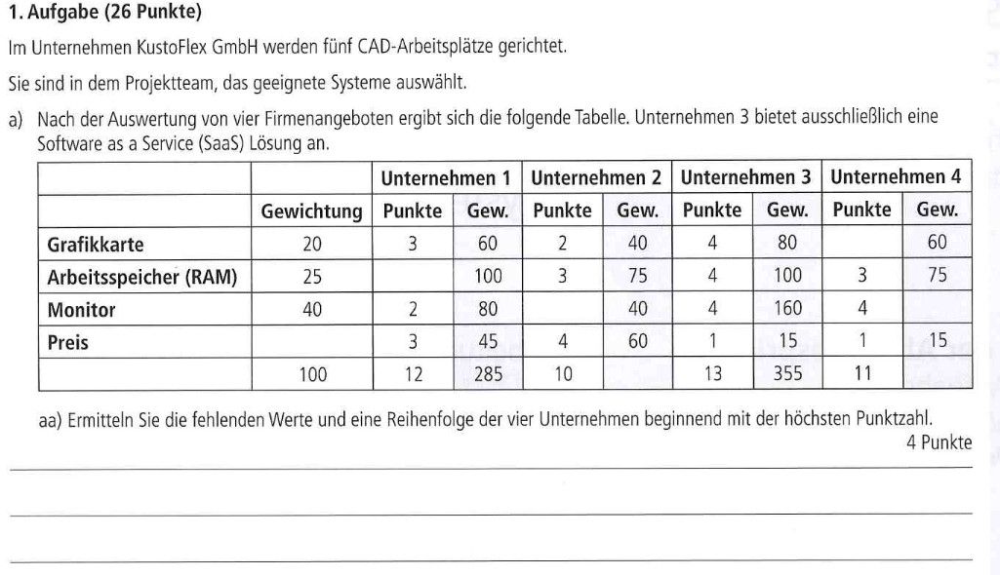

# Inhaltsverzeichnis

1. [[#Support & Serviceanfragen (First-, Second- und Third-Level-Support)]] 
2. [[#Situationsgerechte Kundenkommunikation (z.B. Kundengespräch via Webinar)]]
3. [[#Kundenbedarf ermitteln und Angebote unterbreiten]] #notready #keinplan
4. [[#Quantitative und qualitative Angebotsbewertung]]

---

## Support & Serviceanfragen (First-, Second- und Third-Level-Support)

**First-Level-Support:** 
- Erste Anlaufstelle für Kunden oder Mitarbeiter mit IT-Problemen
- Mitarbeiter arbeiten oft nach einem Skript oder Checklisten
- Häufigere Aufgaben: Passwortzurücksetzungen, grundlegende Anwendungsprobleme, Hardware-Anfragen
- Weiterleitung an Second-Level-Support, falls keine Lösung gefunden wird

**Second-Level-Support:**
- Tiefere Analyse und Bearbeitung komplexer Probleme
- Zugriff auf weiterführende Werkzeuge und Diagnosedaten
- Kann Lösungen dokumentieren, um den First-Level-Support zu optimieren
- Arbeitet eng mit dem Third-Level-Support oder Entwicklern zusammen

**Third-Level-Support:** 
- Höchste Eskalationsstufe → Entwickelte IT-Experten, Hersteller oder Software-Entwickler
- Bearbeitung kritischer oder spezifischer technischer Probleme, die nicht im Second-Level gelöst werden können
- Mögliche Änderungen am Quellcode oder an der Systemarchitektur

#### Eskalationsmanagement

- **Dringlichkeit (Urgency):**  
    → Wie stark wirkt sich die Störung auf das Erreichen des Ziels aus?  
    _z. B. Kann ein Mitarbeiter weiterarbeiten oder steht eine ganze Abteilung still?_
    
- **Auswirkung (Impact):**  
    → Wie viele Nutzer oder Systeme sind betroffen?  
    _z. B. Ist nur ein einzelner Drucker defekt oder das gesamte Netzwerk ausgefallen?_

| Priorität | Dringlichkeit | Auswirkung | Beispiel                          |
| --------- | ------------- | ---------- | --------------------------------- |
| Hoch      | Hoch          | Hoch       | Serverausfall für gesamte Firma   |
| Mittel    | Hoch          | Mittel     | Einzelne Abteilung betroffen      |
| Niedrig   | Niedrig       | Niedrig    | Ein User kann sich nicht anmelden |

#### Vorteile eines strukturierten Supports

**Nachvollziehbarkeit:** Alle Anfragen werden dokumentiert (Ticketsysteme wie Jira, OTRS)  
**Effiziente Bearbeitung:** Schnelle Identifikation & Lösung durch klare Strukturen  
**Einhaltung von SLAs (Service-Level-Agreements):** Zeitliche Fristen für Reaktions- & Lösungszeiten  
**Automatisierung:** FAQ-Bots, Auto-Reply-E-Mails für Statusupdates  
**Kostenkontrolle:** Effizienzsteigerung reduziert Support-Kosten

---

## Situationsgerechte Kundenkommunikation (z.B. Kundengespräch via Webinar)

**==Wichtig!== *Dieser Bereich ist eher orientiert an praktischen Fertigkeiten und Kompetenzen statt theoretischem Wissen. Fachwissen ist als per se nicht erforderlich.***

Effektive Kommunikation mit Kunden ist essenziell, um Probleme zu lösen, Vertrauen aufzubauen und eine hohe Kundenzufriedenheit zu gewährleisten. Die Wahl des richtigen Kommunikationskanals hängt von der Situation, dem Kundenprofil und der Dringlichkeit des Anliegens ab.
#### Beispiele für Kommunikationskanäle & deren Einsatz

| **Kanal**                  | **Einsatzbereich**                           | **Vorteile**                                    | **Nachteile**                                             |
| -------------------------- | -------------------------------------------- | ----------------------------------------------- | --------------------------------------------------------- |
| **Telefon**                | Direkte, persönliche Klärung akuter Anliegen | Schnell, persönlich, direkte Rückfragen möglich | Keine visuelle Unterstützung, dokumentationsintensiv      |
| **E-Mail**                 | Formelle Anfragen, Support-Tickets           | Schriftlich dokumentiert, zeitunabhängig        | Verzögerte Reaktionszeit, Missverständnisse möglich       |
| **Live-Chat**              | Schnelle Klärung kleinerer Anliegen          | Echtzeit-Kommunikation, schnelle Antwortzeit    | Nicht für komplexe Probleme geeignet                      |
| **Webinar/Videokonferenz** | Beratung, Schulung, Support-Demonstrationen  | Persönlich, visuelle Unterstützung möglich      | Höherer technischer Aufwand, evtl. geringe Teilnehmerzahl |
| **Ticket-System**          | Support-Anfragen & Fehlerbehebung            | Strukturiert, priorisierbar, dokumentiert       | Weniger persönliche Interaktion                           |
| **Social Media**           | Öffentliches Feedback, Kundenbindung         | Direkter Kontakt, hohe Reichweite               | Gefahr negativer Publicity                                |

---

## Kundenbedarf ermitteln und Angebote unterbreiten

==!Unklar ob relevant, und wenn was==

### 1. Kundenbedarf ermitteln

#### Definition
- **Kundenbedarf**: Die spezifischen Anforderungen und Wünsche eines Kunden an ein Produkt oder eine Dienstleistung.

#### Schritte zur Ermittlung des Kundenbedarfs
1. **Kundengespräche führen**: Direkte Kommunikation mit dem Kunden, um seine Bedürfnisse zu verstehen.
2. **Anforderungsanalyse**: Systematische Erfassung und Dokumentation der Kundenanforderungen.
3. **Marktforschung**: Analyse des Marktes und der Konkurrenz, um zusätzliche Bedürfnisse zu identifizieren.
4. **Fragebögen und Umfragen**: Strukturierte Erhebung von Kundenmeinungen und -wünschen.
5. **Workshops und Meetings**: Gemeinsame Erarbeitung der Anforderungen mit dem Kunden.

#### Werkzeuge und Techniken
- **Interviews**: Direkte Gespräche mit dem Kunden.
- **Use Cases**: Szenarien, die die Interaktion des Kunden mit dem System beschreiben.
- **Personas**: Fiktive Charaktere, die typische Nutzergruppen repräsentieren.
- **Prototyping**: Erstellung von frühen Modellen des Produkts zur Veranschaulichung und Diskussion.

### 2. Angebote unterbreiten

#### Definition
- **Angebot**: Eine detaillierte Beschreibung der Produkte oder Dienstleistungen, die einem Kunden zu einem bestimmten Preis angeboten werden.

#### Schritte zur Erstellung eines Angebots
1. **Bedarfsermittlung**: Verstehen der spezifischen Anforderungen des Kunden.
2. **Leistungsbeschreibung**: Detaillierte Beschreibung der angebotenen Produkte oder Dienstleistungen.
3. **Kalkulation**: Berechnung der Kosten und Festlegung des Preises.
4. **Angebotsdokument erstellen**: Zusammenstellung aller relevanten Informationen in einem formalen Dokument.
5. **Angebotspräsentation**: Vorstellung des Angebots beim Kunden und Beantwortung von Fragen.

#### Bestandteile eines Angebots
- **Deckblatt**: Enthält die grundlegenden Informationen wie Firmenname, Kundendaten und Angebotsdatum.
- **Einleitung**: Kurze Zusammenfassung des Angebots und der Kundenanforderungen.
- **Leistungsbeschreibung**: Detaillierte Beschreibung der angebotenen Produkte oder Dienstleistungen.
- **Kostenaufstellung**: Auflistung der Kosten und Preise.
- **AGB**: Allgemeine Geschäftsbedingungen.
- **Unterschrift**: Unterschrift des Anbieters und ggf. des Kunden.

#### Tipps für erfolgreiche Angebote
- **Klarheit und Präzision**: Das Angebot sollte klar und verständlich formuliert sein.
- **Kundenspezifisch**: Das Angebot sollte auf die spezifischen Bedürfnisse des Kunden zugeschnitten sein.
- **Transparenz**: Alle Kosten und Leistungen sollten transparent dargestellt werden.
- **Fristen**: Angabe von Fristen für die Annahme des Angebots und die Lieferung der Leistungen.

### 3. Praxisbeispiele

#### Beispiel 1: Softwareentwicklung
- **Kundenbedarf**: Ein Unternehmen benötigt eine maßgeschneiderte Softwarelösung zur Verwaltung seiner Kundendaten.
- **Angebot**: Entwicklung einer CRM-Software (Customer Relationship Management) inklusive Installation, Schulung und Support.

#### Beispiel 2: Webentwicklung
- **Kundenbedarf**: Ein Online-Shop möchte seine Website modernisieren und für mobile Geräte optimieren.
- **Angebot**: Redesign der Website, Implementierung eines responsiven Designs und Optimierung der Ladezeiten.

----

## Quantitative und qualitative Angebotsbewertung (Angebotsvergleich)

Ein Angebotsvergleich dient dazu, verschiedene Angebote anhand quantitativer (messbarer) und qualitativer (subjektiver) Kriterien systematisch zu bewerten.

#### Quantitative Angebotsbewertung

Diese Bewertung basiert auf **messbaren** und **rechnerischen** Faktoren:

**Bezugspreis / Preis pro Stück** → Der eigentliche Kaufpreis einer Einheit  
**Bezugskosten** → Transport-, Verpackungs- und sonstige Nebenkosten  
**Rabatte & Skonto** → Vergünstigungen durch frühzeitige Zahlung oder große Bestellmengen

**Ziel:** Den wirtschaftlich günstigsten Anbieter ermitteln.

##### Bezugskalkulation

$$

\begin{equation}
\begin{matrix}
    Listeneinkaufspreis \\ 
    -Lieferantenrabatt \\ 
    =Zieleinkaufspreis \\
    -Lieferantenskonto \\
    =Bareinkaufspreis \\
    +Bezugskosten \\
    =Bezugspreis
\end{matrix}
\end{equation}

$$

**Kurzgesagt:**

- Rabatt abziehen
- Skonto abziehen
- Bezugskosten (Lieferkosten etc.) dazurechnen

#### Qualitative Angebotsbewertung

Hierbei geht es um nicht-messbare, aber entscheidende Faktoren:

**Support & Service** → Wie gut ist der Kundensupport? Gibt es schnelle Hilfe bei Problemen?  
**Qualität** → Material, Verarbeitung und Haltbarkeit der Produkte  
**Nachhaltigkeit & Regionalität** → Umweltfreundlichkeit, CO₂-Fußabdruck, lokale Produktion  
**Zuverlässigkeit** → Pünktliche Lieferung, Vertragseinhaltung  
**Geschäftsbeziehung** → Bestehende Partnerschaft, Sonderkonditionen

**Ziel:** Den Anbieter mit der besten Gesamtleistung ermitteln.

##### Nutzwertanalyse (Scoring-Modell)

Die Nutzwertanalyse kombiniert qualitative und quantitative Kriterien, um die **beste Entscheidung** zu treffen.

**Ablauf:**

1. Gewichtung der Kriterien (Summe der Gewichte = 1 oder 100 %)
2. Bewertung der Anbieter (z. B. 1–10 Punkte je Kriterium, teilweise 1-5 Punkte je nach Aufgabe)
3. Multiplikation der Punkte mit der Gewichtung
4. **Summierung der Nutzwerte → Höchster Wert = beste Wahl**

Beispiel Nutzwertanalyse:

![[Pasted image 20250318132238.png]]

---

## Technische und kaufmännische Texte in deutscher und englischer Sprache

---

## Präsentation und Medienkompetenz

# Inhaltsverzeichnis

1. [[#Support & Serviceanfragen (First-, Second- und Third-Level-Support)]] 
2. [[#Situationsgerechte Kundenkommunikation (z.B. Kundengespräch via Webinar)]] 
3. [[#Kundenbedarf ermitteln und Angebote unterbreiten]] 
4. [[#Quantitative und qualitative Angebotsbewertung]] 
5. [[#Interpretation englischsprachiger Texte]] 
6. [[#Technische und kaufmännische Texte in deutscher und englischer Sprache]] 
7. [[#Präsentation und Medienkompetenz]] 

---

## Support & Serviceanfragen (First-, Second- und Third-Level-Support)

**First-Level-Support:** Hier arbeiten qualifizierte, aber weniger fachkundige Mitarbeiter, die das Problem eventuell bereits lösen können oder es an den Second-Level-Support und letztlich dann an den Third-Level-Support weitergeben.

**Second-Level-Support:** Hier arbeiten spezialisierte Fachleute das Problem, der Mitarbeiter nutzt einen Teil seiner Arbeitszeit zur Weiterbildung. Erarbeitete Lösungen speichert er in einer Wissensdatenbank, um den First-Level-Support zu unterstützen.

**Third-Level-Support:** Hersteller bzw. externe Stellen; Kann auch Fachabteilung oder Programmierer selbst. Er stellt hier die höchste fachliche Ebene des Supports.

außerdem:

- **Dringlichkeit (eng. "Urgency"):** Wie stark wirkt sich die Störung auf das Erreichen des Ziels aus?
- **Auswirkung (eng. "Impact"):** Wie viele Mitarbeiter sind betroffen?

plus:

###### Vorteile:
- Nachvollzierbarkeit aller Anfragen
- Systematische Bearbeitung von Anfragen
- EInhaltung von Service-Level-Agreements
- Automatisierung von Antworten und Statusmeldungen
- Kostenüberwachung für die Bearbeitung von Anfragen

---

## Situationsgerechte Kundenkommunikation (z.B. Kundengespräch via Webinar)

- Anpassung der Sprache an das technische Verständnis des Kunden (Laie vs. IT-Experte)
- Webinare und Remote-Support:
	- Nutzen von Bildschirmfreigabe-Tools (z.B. Teamviewer, AnyDesk, Zoom, Microsoft Teams).
	- Strukturierte Vorgehensweise: Begrüßung -> Problemaufnahme -> Lösungsvorschläge -> Umsetzung
	- Aktives Zuhören und kundenfreundliche Sprache verwenden.
- Dokumentation nach dem Gespräch (Lösungsschritte, nächste Maßnahmen)

Prüfungsrelevante Themen:
- Kundenzufriedenheit durch klare Kommunikation
- Ticketsysteme und deren Bedeutung
- Protokollierung von Gesprächen zur Nachverfolgung

---

## Kundenbedarf ermitteln und Angebote unterbreiten

- **Anamnese:** Klärung der Anforderungen durch gezielte Fragen (z.B. "Wie viele Nutzer haben Sie?"/"Welche Anwendungen sollen laufen?").
- **Angebotsphase:**
	- Auswahl passender Hard-/Softwarelösungen basierend auf den Anforderungen.
	- Preis-Leistungs-Verhältnis beachten
	- ggf. Alternativangebote vorschlagen
- **Präsentation des Angebots:**
	- Klare Darstellung der Vorteile
	- Aufzeigen von Skalierbarkeit und Zukunftssicherheit

###### Prüfungsrelevante Themen:
- **Bedarfanalyse** (Was benötigt der Kunde wirklich?).
- **Wirtschaftlichkeitsbetrachtung** (Kosten/Nutzen).
- **Vergleich von Lösungen** (Cloud vs. On-Premises, Open Source vs. Proprietär).

----

## Quantitative und qualitative Angebotsbewertung

auch als Angebotsvergleich genannt

###### Quantitativ
- Bezugspreis / Preis pro Stück
- Bezugskonten
- Rabatt / Skonto

###### Qualitativ
- Support
- Qualität
- Nachhaltigkeit / Umweltschutz / Regionalität
- Zuverlässigkeit
- Geschäftsbeziehung

###### Folgen, wenn kein Angebotsvergleich durchgeführt wurde
- Mangelnde Qualität: Beschwerden, Reparaturkosten, Imageverlust
- Lieferzeit zu lange: Fehlerverkäufe
- Zahlungsziel zu kurz: Liquiditätsengpässe

###### Bezugskalkulation
$$

\begin{equation}
\begin{matrix}
    Listeneinkaufspreis \\ 
    -Lieferantenrabatt \\ 
    =Zieleinkaufspreis \\
    -Lieferantenskonto \\
    =Bareinkaufspreis \\
    +Bezugskosten \\
    =Bezugspreis
\end{matrix}
\end{equation}

$$
Kurzgesagt:
- Rabatt abziehen
- Skonto abziehen
- Lieferkosten dazurechnen

###### Nutzwertanalyse
- Beurteilungsverfahren von qualitativen und quantitativen Kriterien
- Gewichtung der einzelnen Kriterien
- Alle Gewichtungen zusammengerechnet ergeben immer Eins
- Jede der einzelnen Auswahlmöglichkeiten bekommt eine Punkteanzahl zwischen 1 und 10
- Nutzwert ergibt sich aus der Multiplikation von Gewichtung und Punktzahl

Beispielaufgabe Nutzwertanalyse:

---

## Interpretation englischsprachiger Texte#

- Es gibt so viele Quellen, Fehlermeldungen usw in der IT-Welt, die nur auf englisch verfasst sind.
- Wichtig ist das Versthene von technischen Fachbegriffen (z.B. "Kernel Panic", "Fault Tolerance").
- Nutzung von Übersetzungstools oder Fachwörterbüchern

Beispiele, die schon in der Prüfung vorkommen würde...
- Lesen von Hersteller-FAQs
- Patchnotes oder Release Notes verstehen
- Fehlermeldungen interpretieren und Lösungen finden.

Prüfungsrelevante Themen:
- Fachbegriffe im IT-Englisch
- Übersetzen und Zusammenfassen von technischen Anleitungen
- Fehlermeldungen analysieren und interpretieren

---

## Technische und kaufmännische Texte in deutscher und englischer Sprache

Prüfungsrelevante Themen:
- E-Mail-Formulierungen im IT-Umfeld
- Technische Dokumentation erstellen
- Rechtliche Aspekte bei Lizenzen (EULA, Open-Source-Lizenzen)

Kaufmännisch gemeint:
- Angebote
- Rechnungen
- Bestellungen
- und Lizenzbedingungen verstehen und interpretieren (EULA, Open-Source und co)

Technisch gemeint:
- Handbücher 
- Installationsanleitungen
- Change-Logs
- Wartungsprotokolle oder Fehlertickets schreiben

---

## Präsentation und Medienkompetenz

- Grundlagen von Präsentationstechniken
- Technische Inhalte verständlich erklären
- Datenschutz und Sicherheit im Umgang mit Medien

